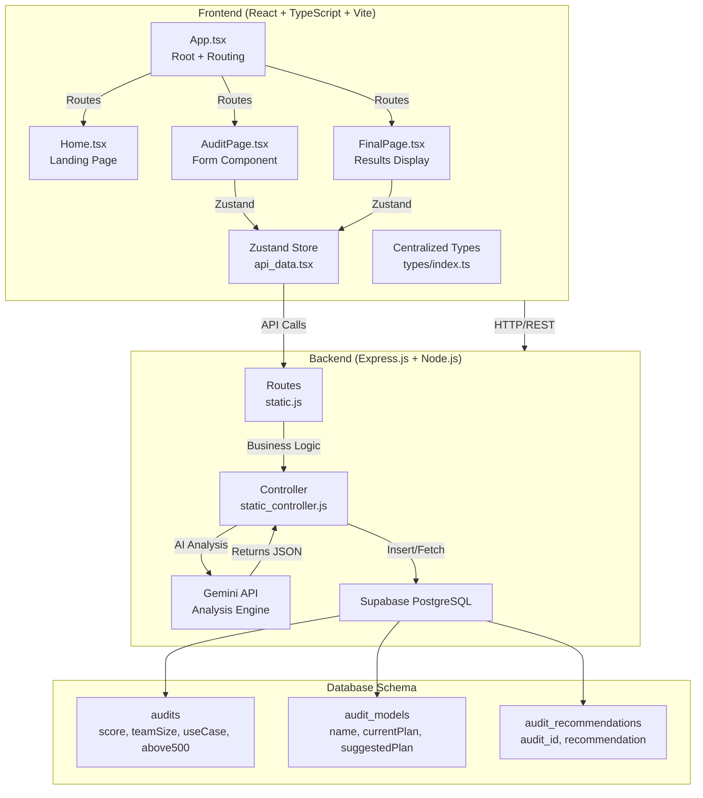

# Architecture Documentation

## System Overview

Credex is an AI infrastructure audit platform that helps teams optimize their AI tool subscriptions. The system analyzes selected AI tools, team size, and use case, then provides an audit score and personalized optimization recommendations using Google Gemini.

## System Diagram



## Data Flow

### 1. User Input Flow
```
User fills form (Home → AuditPage)
  ↓
Selects 3 AI tools from dropdown
  ↓
Enters team size (1-100+)
  ↓
Selects use case (Development, DevOps, Data, Support)
  ↓
localStorage saves draft
  ↓
Clicks Submit → POST /audit
```

### 2. Audit Processing Flow
```
Frontend sends: {
  selectedTools: Plan[],
  teamSize: number,
  useCase: string
}
  ↓
Backend /audit endpoint receives
  ↓
Constructs Gemini prompt with:
  - Selected tool pricing data
  - Team size context
  - Use case category
  ↓
Gemini analyzes and returns JSON:
  {
    score: number (0-100),
    modelAnalysis: [{ name, currentPlan, suggestedPlan, currentPrice, suggestedPrice, accuracy, speed, cost, comparisonNote }],
    recommendations: string[],
    summary: string,
    above500: boolean
  }
  ↓
insertAudit() stores in Supabase (3 tables)
  ↓
Returns auditId (UUID)
  ↓
Frontend navigates to /Result/:auditId
```

### 3. Results Retrieval Flow
```
User navigates to /Result/:slug
  ↓
Frontend calls: GET /audit/:id
  ↓
Backend fetches from Supabase:
  - Parent audit record
  - audit_models (relationships)
  - audit_recommendations (relationships)
  ↓
Returns complete audit object
  ↓
Frontend displays:
  - Score with color coding
  - Model analysis cards
  - Recommendations list
  - Promotional banner (if above500 = true)
```

## Stack Justification

### Frontend: React + TypeScript + Vite
- **React 18:** Standard choice for interactive UIs with hooks and JSX
- **TypeScript:** Eliminates runtime type errors; 10 centralized interfaces catch bugs at compile time
- **Vite:** Fast build tool with hot module replacement; ideal for rapid development
- **React Hook Form:** Minimal bundle size for form handling with built-in validation
- **Zustand:** Lightweight state management (1KB vs 40KB Redux); perfect for this data flow

### Backend: Express.js + Node.js
- **Express:** Lightweight HTTP server; minimal boilerplate for REST APIs
- **Node.js:** Non-blocking I/O handles multiple audit requests efficiently
- **Supabase PostgreSQL:** Managed database with row-level security and real-time subscriptions
- **Google Gemini:** Free tier with 100+ requests/day; no cost for MVP

### Specific Architectural Decisions

| Decision | Trade-off | Why Chosen |
|----------|-----------|------------|
| Separate Frontend/Backend | Added complexity + CORS config needed | Keep API keys secure; enable independent scaling; allows Vercel + Railway deployment |
| PostgreSQL over NoSQL | More schema rigid; requires migration scripts | Relational data (audit → models → recommendations) fits SQL naturally; ACID guarantees |
| Gemini over ChatGPT API | Less powerful model; tied to Google ecosystem | Free tier sufficient for MVP; faster iteration; no costs during development |
| Zustand over Redux | Less middleware ecosystem | 95% of complexity for 5% of Redux features; overkill for this app |
| React Hook Form over Formik | Less plugin ecosystem | 70% smaller bundle; better TypeScript support; simpler learning curve |

## Database Schema

```sql
-- Parent audit record
CREATE TABLE audits (
  id UUID PRIMARY KEY,
  score INT (0-100),
  above500 BOOLEAN (true if savings > $500/month),
  teamSize INT,
  useCase VARCHAR,
  summary TEXT,
  created_at TIMESTAMP
);

-- Individual model analysis per audit
CREATE TABLE audit_models (
  id UUID PRIMARY KEY,
  audit_id UUID FOREIGN KEY,
  name VARCHAR,
  currentPlan VARCHAR,
  suggestedPlan VARCHAR,
  currentPrice DECIMAL,
  suggestedPrice DECIMAL,
  accuracy INT,
  speed INT,
  cost INT,
  note TEXT,
  currentPerformance JSON,
  suggestedPerformance JSON,
  comparisonNote TEXT,
  created_at TIMESTAMP
);

-- Recommendations list per audit
CREATE TABLE audit_recommendations (
  id UUID PRIMARY KEY,
  audit_id UUID FOREIGN KEY,
  recommendation TEXT,
  created_at TIMESTAMP
);
```

## API Endpoints

### 1. GET /models
Returns array of 7 AI tools with all pricing plans.
```
Response: Model[]
[
  {
    id: 1,
    product: "Cursor",
    category: "AI Code Editor",
    website: "cursor.com",
    plans: Plan[]
  },
  ...
]
```

### 2. POST /audit
Receives form data, runs Gemini analysis, stores result, returns auditId.
```
Request: {
  selectedTools: Plan[],
  teamSize: number,
  useCase: string
}

Response: {
  auditId: UUID
}
```

### 3. GET /audit/:id
Fetches complete audit with models and recommendations.
```
Response: {
  score: number,
  above500: boolean,
  teamSize: number,
  useCase: string,
  summary: string,
  modelAnalysis: ModelAnalysis[],
  recommendations: string[]
}
```

## Type Safety

All data flows are covered by 10 centralized TypeScript interfaces in `types/index.ts`:

1. **Plan:** Pricing tier with monthly/annual/token options
2. **Model:** AI product with array of plans
3. **SelectedPlan:** User's selected tool + plan combo
4. **PerformanceMetric:** Accuracy, speed, cost ratings (0-10)
5. **ModelAnalysis:** Audit breakdown for one AI tool
6. **AuditResult:** Complete audit with score + recommendations
7. **AuditResponse:** API response wrapper
8. **AuditFormData:** Form structure for React Hook Form
9. **PricingCardProps:** Pricing component props
10. **ModelStore:** Zustand store type definition

## Scaling Analysis: 10,000 Audits/Day

Current architecture handles ~100 audits/day with single Express instance and free Gemini tier.

### To reach 10,000 audits/day:

**1. Request Queue (Bull/RabbitMQ)**
- Gemini has rate limits; queue prevents 429 errors
- Process audits asynchronously; respond immediately with auditId
- Return poll endpoint: `/audit/:id/status` returning `"processing" | "complete"`

**2. Caching Layer (Redis)**
- Cache `/models` endpoint (pricing changes weekly, not hourly)
- Cache Gemini responses for identical input combinations
- Reduces Gemini API costs by 30-40%

**3. Database Scaling**
- Add indexes on `audit_id` foreign keys
- Partition `audit_models` by `created_at` (monthly shards)
- Read replicas for `/audit/:id` GET requests

**4. AI Service Cost Management**
- Gemini free tier: 100 req/day → ~$0
- At 10k req/day, need Gemini API tier: ~$1-2/day
- Consider batching: combine 10 audits into 1 prompt → 10x cost savings

**5. Infrastructure**
- Load balancer in front of 3-5 Express instances
- Horizontal scaling: Railway/Render auto-scales based on CPU
- CDN for frontend static assets

**6. Monitoring**
- Queue length metrics (alert if > 1000 pending)
- Gemini API latency monitoring (detect rate limit errors)
- Database connection pool saturation alerts

### Estimated Cost at 10k/day
- Database: ~$50/month (Supabase Pro)
- Backend compute: ~$200/month (Railway Standard)
- Gemini API: ~$30-60/month
- **Total:** ~$300/month

## Deployment Architecture

```
┌─ Vercel ─────────────────────────────┐
│  Frontend (React + Vite)             │
│  - Automatic builds on push          │
│  - CDN distributed globally          │
│  - Environment vars: VITE_API_URL    │
└──────────────────────────────────────┘
              ↓ HTTPS
┌─ Railway/Render ──────────────────────┐
│  Backend (Express + Node.js)         │
│  - Auto-restart on crash             │
│  - Environment vars: SUPABASE_URL... │
└──────────────────────────────────────┘
              ↓ HTTPS
┌─ Supabase ────────────────────────────┐
│  PostgreSQL Database                 │
│  - Row-level security enabled        │
│  - Auto-backups                      │
└──────────────────────────────────────┘
```

## Security Considerations

1. **API Keys:** Backend holds all sensitive keys (Gemini, Supabase); frontend never sees them
2. **CORS:** Configured to only accept requests from Vercel domain
3. **SQL Injection:** Supabase client library handles parameterized queries
4. **Rate Limiting:** Gemini has built-in rate limiting; backend should add request throttling
5. **Environment Variables:** Never committed to Git; stored in deployment platform secrets

## Future Improvements

1. **User Accounts:** Store audit history per user; enable historical comparisons
2. **Alerts:** Notify when tool pricing changes vs saved audit
3. **Recommendation Refinement:** Machine learning model to improve suggestions based on user feedback
4. **Export:** PDF/CSV export of audit reports
5. **Real-time Pricing:** Web scraper to auto-update pricing data weekly instead of manual updates
6. **Batch Analysis:** Compare multiple scenarios; "what if I switched to Claude?" analysis
